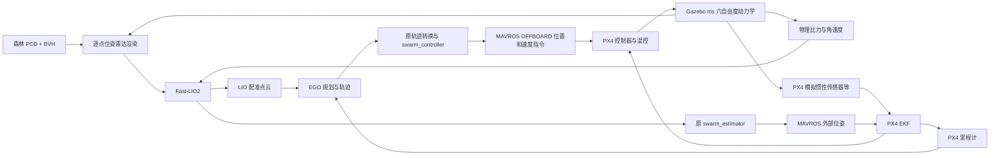

# Mspace 统一仿真入口

森林仿真代码全部位于 `Simulation/`。

## 完整流程

### 一、forest_lio：用真实 bag 离线准备场景

这一步通常只做一次；换森林数据或重建地图时才重新执行，不是每次启动仿真都重新回放 bag。

```text
真实 Mid-360 点云 + IMU rosbag
    → audit：检查话题、时间戳、逐点时间和有效回波
    → replay：仅把原始雷达/IMU输入 Modules 中的 Fast-LIO2
    → forest_map.pcd + replayed_lio.tum + observations.bag
    → coverage：从观测记录生成稀疏覆盖证据 coverage.npz
    → prepare-scene：选择参考窗口，生成地图坐标变换及参考目标
    → scene.json
```

| 数据 | 用途 |
| --- | --- |
| forest_map.pcd | 模拟森林环境的几何来源，受原采集覆盖和 LIO 漂移影响。 |
| replayed_lio.tum | 回放定位轨迹，用于场景对齐及参考路线，不是原飞行独立真值。 |
| observations.bag / coverage.npz | 已观测区域、回波端点与射线经过证据，用于离线评估；不证明整格可通行。 |
| scene.json | 引用地图、覆盖文件，保存局部 world 与原地图的变换及参考任务目标。 |
| 原始雷达/IMU bag | 在线仿真仍读取其中的 Mid-360 扫描方向/逐点时间模板；不直接驱动模拟机体运动。 |

当前数据已准备好：地图在 `artifacts/forest_lio/normal_map_replay_v2/forest_map.pcd`，覆盖在 `normal_map_coverage/coverage.npz`，场景为 `artifacts/forest_lio/route_125_155.json`。**直接跳到一键启动即可，无需重建。** 原始 bag 保留在 `~/bagfiles/`，生成结果统一放在项目根目录 `artifacts/`。

需要从当前 bag 重新准备时，先按下方“加载环境与检查准备”加载环境，再执行：

```bash
BAG="$HOME/bagfiles/yxb_20260208-104116.bag"
DATA="artifacts/forest_lio/scene_$(date +%Y%m%d_%H%M%S)"
python3 Simulation/run.py audit "$BAG" --output "$DATA/audit"
python3 Simulation/run.py replay "$BAG" \
  --output "$DATA/replay" --duration 192.8 --rate .5 \
  --capture-clouds --map-window 40 195
python3 Simulation/run.py coverage "$DATA/replay/observations.bag" \
  --output "$DATA/coverage"
BAG_START=$(python3 -c 'import rosbag,sys; b=rosbag.Bag(sys.argv[1]); print(b.get_start_time()); b.close()' "$BAG")
python3 Simulation/run.py prepare-scene \
  --replay "$DATA/replay" --coverage "$DATA/coverage/coverage.npz" \
  --window 125 155 --bag-start "$BAG_START" --output "$DATA/scene.json"
# 启动新场景，不覆盖默认场景或已有实验。
bash Simulation/start.sh short --scene "$DATA/scene.json" --template-bag "$BAG"
```

上述正常地图 40–195 s、参考路线 125–155 s 和 duration=192.8 专用于当前 bag；首个原始记录约在 bag 起点后 2.132 s，LIO 初始化仍从该记录开始。末尾主动切 MANUAL 不作为算法错误。其他 bag 必须核对话题、时长和正常窗口；当前 PX4 入口的扫描模板话题及 40–120 s 窗口也按此 bag 配置，不能仅替换文件名就假定兼容。

### 二、运行 PX4 森林闭环（在线）

px4_forest 加载 scene.json 和森林 PCD，在启动时构建射线查询索引（BVH），随后按 Gazebo 实际运动逐点生成新的雷达测量与物理 IMU，再送回原 Modules。不会把离线地图直接注入 EGO，也不会按 bag 的参考轨迹强制移动无人机。每次飞行的 LIO 都重新处理模拟传感器数据、定位和建图。




- Gazebo 依据电机输出更新机体位置、速度、姿态；无需飞行视频或飞控记录来驱动模拟运动。
- 每条雷达射线按该点时间对应的机体位姿和雷达外参查询森林 PCD，形成带逐点时间的 Livox CustomMsg；IMU 来自同一物理运动，向本项目 Fast-LIO2 输入时使用 g 单位。
- Fast-LIO2 用模拟雷达和 IMU 定位、建图。原 swarm_estimator 将高频位姿经 MAVROS 输入 PX4 EKF；EGO 复用原实机模板，订阅 PX4 里程计与 Fast-LIO2 配准点云。
- EGO 轨迹经原 traj_server、ego_traj_to_cmd 和 swarm_controller 转换，通过 MAVROS OFFBOARD 发送给 PX4；PX4 控制器、混控和 Gazebo 电机响应共同决定下一时刻运动。
- 森林阶段没有 GPS 插件，关闭真值外部位姿输出。物理真值仅用于生成传感器和评估，不作为 LIO、EGO 或 PX4 的导航位置输入。
- 终点必须连续满足停留条件，且仍处于已解锁 OFFBOARD。传感器积压超限明确判失败，不用旧点云或陈旧遮挡结果填补。

### 三、评估与保存

每次运行保存参数、PX4 状态、原生 ULog、话题订阅审计、物理 / LIO / PX4 轨迹、IMU、雷达帧统计、传感器耗时和日志。`result.json` 为本次验收结果；报告还核对原生 EKF 融合标志。

## 目录

```text
Simulation/
├── start.sh              # 一键加载环境、启动任务、生成报告
├── run.py                # Python 工具统一入口
├── forest_lio/           # bag 审计/回放、场景准备、PCD 雷达渲染、评估
│   ├── scripts/ launch/ config/ native/ tests/
│   └── docs/             # 当前地图/覆盖与射线渲染说明
└── px4_forest/           # PX4/Gazebo闭环编排、物理IMU、可视化与验收
    ├── scripts/ config/ native/ tests/
    └── docs/             # 模块接口与当前网格验收
```

历史轻量 `closed-loop` 仍用于隔离验证传感器与定位，采用简化运动模型；主飞行测试使用 px4_forest。早期阶段/轻量路线报告已从 docs 移到 `artifacts/forest_lio/historical_reports/`，PX4 旧入口历史记录位于 `artifacts/px4_forest/historical_reports/`。源目录的 docs 仅保留当前相关说明，脚本生成的报告写入 artifacts。旧示例包与部署 shell 已移除。

## 一键启动

从项目根目录运行；脚本自动加载 ROS Noetic、外部 Livox 和项目 devel 环境，检查输入，默认打开 Gazebo + RViz：

```bash
bash Simulation/start.sh             # 完整 15 点网格；半速，成功后保留窗口
bash Simulation/start.sh small       # 六目标网格
bash Simulation/start.sh short       # 起飞 + scene 第一个参考目标
bash Simulation/start.sh hover       # 仅 PX4/Gazebo 悬停诊断
bash Simulation/start.sh test        # 自动加载环境，运行全部 43 个测试
```

每次执行一个实验。默认生成独立的 `artifacts/px4_forest/<模式>_<时间>_<PID>/` 输出目录；成功且保留窗口时，关闭窗口或 Ctrl+C 后保存结果并自动生成 report.md、flight.png 与原请求点顺序证据。失败返回非零退出码，有 result.json 时也尝试生成失败报告。进程清理由原隔离运行器负责。

常用选项：

```bash
bash Simulation/start.sh --help
bash Simulation/start.sh full --dry-run    # 只检查环境/输入并打印命令，不启动飞行
bash Simulation/start.sh small --headless  # 无窗口，自动结束并生成报告
bash Simulation/start.sh full --speed .25 --no-keep-open
bash Simulation/start.sh full \
  --waypoints Simulation/px4_forest/config/grid_route.json \
  --output artifacts/px4_forest/my_grid_run
# 首次缺少隔离 PX4/插件时单独构建；不自动改动或安装依赖。
bash Simulation/start.sh build
```

脚本可从任意目录用绝对路径调用，路径参数相对于项目根目录。`--scene`、`--template-bag`、`--waypoints`、`--output` 可覆盖输入输出，`--duration` 是仿真时间上限，`--gui` 支持 both/gazebo/rviz/none。外部路径不同可设置 `LIVOX_WORKSPACE`、`ROS_SETUP`；build 的源 PX4 目录可用 `PX4_SOURCE` 设置。项目模块首次构建仍按下面步骤执行 compile.sh。更多参数和手动运行方法如下。

## 仿真测试

当前森林入口运行原 Modules 链路：Fast-LIO2 → swarm_estimator/MAVROS → PX4 EKF → EGO → traj_server → ego_traj_to_cmd → swarm_controller → PX4/Gazebo。Python 负责传感器模拟、地面站操作、显示和验收；飞控 setpoint 和外部定位由原模块发布。

**严格模式六目标与 15 点完整网格均已通过，终点物理误差分别约 8.9 cm、10.1 cm；原请求目标在 LIO 与物理轨迹中均按顺序进入 0.5 m 半径。** 原连续模式会切过中间点，不能用终点悬停替代逐点验收。当前入口显式启用原 EGO 模块新增的 `fsm/strict_waypoint_tracking=true`：实际里程计确认到达后再执行下一点，不能找到可执行目标时停止而不跳过。原模块默认该参数 false，保留连续模式；原 B 样条避障优化器、控制器、地图安全距离和仿真验收半径未改。更新源码后需先重建规划模块或执行 compile.sh。

### 1. 加载环境与检查准备

以下命令在 Ubuntu / WSL Bash 中执行。每个新终端都要加载环境，工作目录为项目根目录：

```bash
cd ~/workspace/mspace
source /opt/ros/noetic/setup.bash
source ~/workspace/ws_livox/devel/setup.bash
source devel/setup.bash
export OPENBLAS_NUM_THREADS=1
export OMP_NUM_THREADS=4

ls artifacts/forest_lio/route_125_155.json
ls ~/bagfiles/yxb_20260208-104116.bag
ls artifacts/px4_forest/PX4-Autopilot/build/px4_sitl_default/bin/px4
ls artifacts/px4_forest/plant_build/libmspace_forest_plant.so
```

已有场景无需重新建图。scene JSON 还引用森林 PCD 和覆盖证据，移动数据时同步核对其中路径。数据准备见 [森林模块说明](forest_lio/README.md)。

原模块尚未构建或修改过模块代码时，先执行 `./compile.sh`，检查最后汇总没有失败，再执行 `source devel/setup.bash`。隔离 PX4 或物理插件尚未构建时执行以下命令，源 PX4 路径按实际安装位置调整：

```bash
python3 Simulation/run.py px4 build --source ~/workspace/PX4_Firmware
```

运行自动化检查，当前共 43 个测试；它们不能替代飞行实验：

```bash
python3 Simulation/run.py test
```

### 2. 首先测试起飞和一个森林目标

当前已实跑通过的原模块短程配置如下。默认打开 Gazebo、RViz，无需另开 roscore、roslaunch 或手动解锁：

```bash
RUN="artifacts/px4_forest/native_short_$(date +%Y%m%d_%H%M%S)"
echo "$RUN"
python3 Simulation/run.py px4 run --stage forest \
  --scene artifacts/forest_lio/route_125_155.json \
  --goals 1 --output "$RUN" \
  --duration 90 --speed .5 --keep-open
```

`--goals 1` 表示起飞后测试 scene 第一个目标，使用原 EGO flight_type=2（PRESET_TARGET）。到达计数包含起飞点，因此完成时是 `goals=2/2`。

观察顺序：

1. `lidar` 帧数增长，RViz 出现实时 LIO 点云；初始化期间机体停在地面是正常现象。
2. 地面站先发送 Takeoff，让原控制器持续发布有效起飞参考，再请求 OFFBOARD/解锁；出现 `mode=OFFBOARD armed=True` 后机体爬升。
3. 起飞稳定后打印 `Native EGO task triggered; station yields to module control.`，原 EGO 开始任务，原控制模块执行轨迹。
4. 完成到达和终点停留验收后，成功任务暂停物理仿真，保留窗口供查看。

`--speed .5` 表示 1 秒仿真时间约对应 2 秒墙钟时间，不改变原模板 0.6 m/s 的规划速度。初始化门槛至少为 8 秒仿真时间，还需等待 LIO、飞控和规划节点就绪，触发可能更晚。`--duration` 是任务循环的仿真时间上限，不是墙钟秒数，也不包含此前的数据准备时间。

原控制器 Takeoff 高度为捕获起飞位置后上升 1.2 m。`--takeoff-height` 当前用于 scene 地图变换和参考轨迹高度，不能用它修改原控制器起飞高度。覆盖项见 [原模块接入约定](px4_forest/docs/module_alignment.md)。

### 3. 测试原生六目标小网格

检查原 generateWps 生成、严格逐点执行和中间点到达。此配置已在半速 Gazebo/RViz 双窗口实跑通过，仍需按你的运行结果验收：

```bash
RUN="artifacts/px4_forest/native_small_grid_$(date +%Y%m%d_%H%M%S)"
echo "$RUN"
python3 Simulation/run.py px4 run --stage forest \
  --scene artifacts/forest_lio/route_125_155.json \
  --waypoints Simulation/px4_forest/config/grid_alignment_smoke.json \
  --output "$RUN" --duration 180 --speed .5 --keep-open
```

目标依次为 `(0,0,2) → (2,0,2) → (4,0,2) → (4,2,2) → (2,2,2) → (0,2,2)`；另有起飞点，完整计数为 7/7。使用原 EGO flight_type=3，由原 C++ generateWps 生成和调度全部目标，Python 同序生成仅用于校验与对照。**网格不能与 --goals 同时使用。**

本次严格模式在 0.5 倍速通过，下面命令使用相同倍速。逐点问题由原模块任务调度修复，降低倍速本身不能解决它。一次只运行一个实验，避免相互争用资源。

### 4. 测试生成路径点完整网格

配置见 [grid_route.json](px4_forest/config/grid_route.json)：

| 参数 | min | max | step |
| ---- | --: | --: | ---: |
| x    |   0 |  32 |    8 |
| y    |   0 |  16 |    8 |
| z    |   2 |   2 |    2 |

waypointDistriFlag=0、grid_direction=0，共 15 个折返目标，另加起飞点，完整计数为 16/16。坐标使用局部 world，单位米；z=2 直接表示初始机体原点以上 2 m，不叠加 takeoff-height。scene 提供森林地图和坐标变换，网格覆盖 scene 的任务目标。

```bash
RUN="artifacts/px4_forest/native_full_grid_$(date +%Y%m%d_%H%M%S)"
echo "$RUN"
python3 Simulation/run.py px4 run --stage forest \
  --scene artifacts/forest_lio/route_125_155.json \
  --waypoints Simulation/px4_forest/config/grid_route.json \
  --output "$RUN" --duration 600 --speed .5 --keep-open
```

600 秒仿真时间在半速下约为 20 分钟墙钟上限，准备和退出另需时间，成功可提前结束。本次完整任务约在 455 秒任务仿真时间内通过，飞行约 15 分钟墙钟时间。先确认本机小网格通过，再做完整网格验收。部分请求点邻近地图障碍，原 EGO 可能重定位或规划失败，结果必须如实记录。

测试 scene 全部参考目标时，使用第 2 步命令去掉 `--goals 1` 并增加 duration；它仍属于 PRESET_TARGET 模式，与 generateWps 网格不同。

### 5. 保存结果，判断是否通过

成功且启用 keep-open 时，关闭保留窗口，或在启动终端按 Ctrl+C，完成保存和清理。打印 result.json 路径后再生成报告：

```bash
python3 Simulation/run.py px4 report "$RUN"
python3 - "$RUN/result.json" <<'PY'
import json, sys
r = json.load(open(sys.argv[1]))
for key in ("status", "errors", "native_trigger_sent", "goal_error_m",
            "goal_min_lio_distance_m", "requested_goal_min_lio_distance_m"):
    print(key, r.get(key))
print("observed arrivals", len(r["arrivals"]), "/", len(r["goals"]))
PY
```

RUN 是本次输出目录；换终端后先设为运行开始时打印的实际目录。输出目录必须为空，日期后缀用于保留每次实验。

| 文件                                      | 用途                                                                                        |
| ----------------------------------------- | ------------------------------------------------------------------------------------------- |
| result.json                               | 状态、错误、到达计数、终点物理误差和各点最近 LIO 距离。                                     |
| report.md、flight.png                     | 报告命令生成的轨迹、误差、耗时与原生 EKF 融合证据。                                         |
| goals / accepted_goals（result 内）       | 原请求目标与观察到的原 EGO 重定位目标；运行器不选择替代点。                                 |
| graph.json                                | 完成审计时应有 module_publishers_valid=true，导航真值订阅列表为空；提前失败可能未完成审计。 |
| module_alignment.json、module_params.json | 原模板、覆盖项和实际 ROS 参数；提前失败可能没有参数快照。                                   |
| sensor_timing.csv                         | 雷达渲染、传输、整帧处理耗时和仿真积压。                                                    |
| navigation.log                            | 原 LIO、EGO、状态估计、轨迹转换和控制模块日志。                                             |
| px4.log、mavros.log、log/                 | 飞控状态、通信与原生 PX4 ULog。                                                             |

完整通过要求 status=ok：目标按验收顺序到达，终点 LIO 距离保持小于 0.2 m 至少 3 秒仿真时间，最终物理误差小于 0.3 m，保持已解锁 OFFBOARD，参数与发布者/真值隔离审计通过。中间点以 0.5 m 半径观察到达；最近距离只说明曾接近，不能单独证明顺序。若原 EGO 重定位，通过指向 accepted_goals，不能宣称原请求坐标全部到达。

有窗口、日志或终点悬停不等于完整通过。任务完成前 Ctrl+C 通常记录 failed / Run interrupted；积压超过 0.4 秒仿真时间会判失败，不用旧点云或错误遮挡缓存补齐。

### 6. 窗口与排查

默认 gui=both，需要 Ubuntu 桌面或 WSLg：

- Gazebo 显示 Iris 机体、电机响应和地面运动。
- RViz 显示森林 PCD、实时 LIO 点云、EGO 轨迹、目标及三条轨迹：物理真值蓝色、LIO 橙色、PX4 估计绿色。Fixed Frame 为 world。
- 树木在 RViz 展示，PCD 参与雷达遮挡查询，尚未加入 Gazebo 树木接触碰撞几何。
- 可选 `--gui rviz`、`--gui gazebo`；无窗口用 `--headless`。显示抽稀不改变完整地图的射线查询。

无人机不动时，检查是否 OFFBOARD/解锁、雷达帧数是否增长、是否打印任务触发，再结合 navigation.log 和 px4.log 区分初始化、起飞、定位或规划问题。飞到终点但计数停住时查看各点最近距离及 module_params 中的 strict_waypoint_tracking，确认源码已重新编译且启用严格模式；不能放宽计数来认定成功。

出现 `PCD sensor fell behind physics by >0.4 s` 时，关闭其他实验，用新目录独立复跑；可降低 speed，或用 headless 对比 GUI 负载，保留失败日志和 sensor_timing。降速不保证通过，也不等于实现实时仿真；目前不将 1 倍速作为已验证的原模块网格配置。

每次实验使用私有 ROS/Gazebo Master 和端口，结束只清理本次进程。普通新终端的 rostopic 不会自动连接本次实验。运行期间要检查话题，在第二终端加载环境，将 RUN 设为本次目录，再执行：

```bash
export ROS_MASTER_URI=$(python3 -c 'import json,sys; print("http://127.0.0.1:%s" % json.load(open(sys.argv[1]))["ports"]["ros"])' "$RUN/manifest.json")
export ROS_IP=127.0.0.1
rostopic hz /uav1/drone_Odometry
# Ctrl+C 结束频率查看，再检查状态。
rostopic echo -n 1 /uav1/mavros/state
```

单独诊断 PX4/Gazebo 动力学可运行 hover：

```bash
RUN="artifacts/px4_forest/hover_$(date +%Y%m%d_%H%M%S)"
python3 Simulation/run.py px4 run --stage hover \
  --output "$RUN" --duration 40 --speed .5 --keep-open
```

hover 保留模拟 GPS，由运行器直接发送悬停参考，不代表原 Fast-LIO2、EGO 和控制模块测试。当前入口只验证单机。

其他工具包括 audit、replay、generate、coverage、prepare-scene、closed-loop、profile。用 `python3 Simulation/run.py COMMAND --help` 查看参数；飞行参数用 `python3 Simulation/run.py px4 run --help`。轻量 closed-loop 保留历史参数，不替代本节原模块物理闭环验收。

## 文档与边界

- [森林模块详细用法](forest_lio/README.md)：从原始 bag 到地图、场景和轻量验证。
- [PX4 构建与参数说明](px4_forest/README.md)。
- [当前 PX4 网格验收](px4_forest/docs/validation.md)：当前模式、两组结果、原请求点顺序与性能证据。
- [原模块接入约定](px4_forest/docs/module_alignment.md)：原节点、模板、参数覆盖与话题审计。
- [森林地图与覆盖证据](forest_lio/docs/forest_lio_map_geometry.md)。
- [PCD 雷达候选面与遮挡查询](forest_lio/docs/forest_lio_renderer.md)。

当前是计算机上的 PX4 SITL，实体飞控 HIL 尚未接入；森林 PCD 用于雷达遮挡与测量，暂不提供树木接触碰撞。Iris 动力学和 IMU 尚未按实机标定，多机 PX4 闭环尚未验证。

当前验证结果见 [验证报告](px4_forest/docs/validation.md)：43 个测试及相关规划模块构建通过，严格模式六目标与完整 15 目标双窗口网格均通过（0.5 倍速）。此前六个主模块构建通过，历史连续模式结果与当前严格模式结果分开记录。

## 当前可复现的网格验收结果

| 实验 | 到达计数（含起飞） | 终点物理误差 | 原请求点的 LIO / 物理顺序检查 |
| --- | --- | --- | --- |
| [六目标双窗口报告](../artifacts/px4_forest/grid_strict_visual/report.md) | 7/7 | 8.94 cm | 6/6，均通过 |
| [15 目标双窗口报告](../artifacts/px4_forest/grid_15_strict_visual/report.md) | 16/16 | 10.13 cm | 15/15，均通过 |

两次均使用上面的原生严格模式、原请求网格和 0.5 倍速，没有放宽中间点 0.5 m、终点 0.2 m / 3 秒停留及物理误差 0.3 m 的验收条件。EGO 对小网格 (4,2,2) 重定位约 0.384 m，对完整网格 (24,0,2) 重定位约 0.357 m；报告保留两套坐标，独立轨迹检查仍确认原请求坐标按顺序进入验收半径。这表示满足位置容差，不是精确穿过障碍点。

完整任务生成 4548 帧雷达，LIO 位置 RMSE 约 5.43 cm，雷达整帧处理墙钟 P95 约 43.46 ms，最大仿真积压 0.112 s；发布者与真值隔离审计、ULog 外部位姿融合检查通过。此结果是半速单机 SITL 验收，不代表 1 倍速、多机或实体飞控 HIL 已通过。
