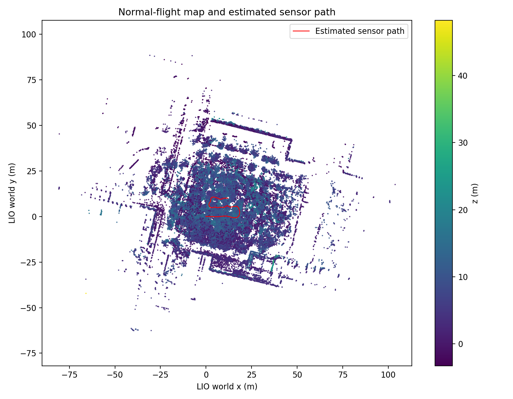

# 正常飞行地图、观测证据与自适应几何验证

数据来自原始 Mid-360/IMU 重放。地图与覆盖都依赖 Fast-LIO2 估计，不能作为原始飞行的独立真值。
用户确认最后切 MANUAL 为主动遥控操作；本次采用保守的正常飞行窗口，不把尾段解释成导航错误。

## 地图与覆盖

- 来源窗口：原 bag 起点后 [40.0, 195.0] s；从首个原始记录启动 LIO 初始化，仅窗口内配准点积累进导出地图。
- 回放状态：ok；输入 1928 帧，LIO 输出 1925，配准点云 1925。
- 地图：1006191 点，体素 0.15 m；XYZ 最小 [-87.92, -81.57, -3.76]，最大 [111.49, 88.94, 66.91]。
- 末帧时间差 0.000010 s；回调错误 []。
- 覆盖处理 1549 帧、1858800 条抽样实际回波射线；时间匹配跳过 0 帧。
- 稀疏证据体素 1561527，边长 0.30 m；射线经过 1561527、实际端点 168044、传感器位置 217（标志可重叠）。
- 覆盖生成耗时 48.35 s；每帧最多 1200 条射线，量程上限 30.0 m。

coverage.npz 标志位：1=射线中心线经过证据，2=实际回波端点，4=传感器位置；不存在的体素=未知。**没有任何标志表示整格或无人机体积已确认可通行。**
使用扫描末端位姿近似反畸变后的射线起点；逐点原始起点、无回波方向与未抽样射线未被补造。遮挡后方仍未知。覆盖目前用于评估，不注入规划器作为自由空间。

## 已知几何验证

| 场景 | 模型 | 误命中率 | 漏命中率 | 同为真命中距离误差 P95 |
| --- | --- | ---: | ---: | ---: |
| thin_strip_4cm | fixed | 71.12% | 0.00% | 0.0000 m |
| thin_strip_4cm | adaptive | 7.49% | 0.00% | 0.0000 m |
| cylinder_radius_8cm | fixed | 61.90% | 0.00% | 0.1686 m |
| cylinder_radius_8cm | adaptive | 0.00% | 0.00% | 0.0026 m |
| wall_hole_25cm | fixed | 0.00% | 0.00% | 3.0091 m |
| wall_hole_25cm | adaptive | 0.00% | 0.00% | 3.0091 m |

误命中率以真实无命中射线为分母，漏命中率以真实命中射线为分母。孔洞场景都有后墙，必须另看前后遮挡误判：

- fixed：前后墙误判 35.59%。
- adaptive：前后墙误判 5.83%。

自适应支持范围由局部间距、PCA 平面性与切向分布确定；平面可信点使用有限圆盘，法向不可靠点保留为小球障碍代理并标记不确定。不能据此恢复未采集的物理表面。
混合球/圆盘、不同逐点半径已与独立穷举求交参考核对；原生 BVH 仍逐射线求最近交点，不缓存旧位姿遮挡。

## 完整地图敏感性

相同 4000 条射线；每个模型分别与自身基准比较。此处仅为单一初始原点的局部诊断，不是全地图航线或真实距离精度验证。

| 模型 | 变体 | 点数 | 有无回波变化 | 共同命中距离差 P95 | 查询 P95 |
| --- | --- | ---: | ---: | ---: | ---: |
| fixed | baseline | 1006191 | 0.00% | 0.000 m | 3.95 ms |
| fixed | radius_cap_0.1 | 1006191 | 4.85% | 11.550 m | 3.60 ms |
| fixed | voxel_0.3m | 324714 | 4.28% | 10.944 m | 2.30 ms |
| adaptive | baseline | 1006191 | 0.00% | 0.000 m | 5.16 ms |
| adaptive | radius_cap_0.1 | 1006191 | 4.28% | 6.824 m | 4.15 ms |
| adaptive | voxel_0.3m | 324714 | 9.80% | 15.675 m | 3.21 ms |

自适应基准：286889 个圆盘、719302 个不确定小球；半径中位数 0.040 m、P95 0.200 m。
**已知几何的障碍膨胀改善不等于森林点云降采样鲁棒性已解决。** 默认仍为 fixed；adaptive 需显式选择。粗化会改变邻域、支持半径和遮挡，缺失几何不能通过索引性能优化修复。

## 复现与下一步

命令见模块 README 的“正常飞行地图与观测证据”。参数和原始结果分别保存在以下目录：

- 回放：artifacts/forest_lio/normal_map_replay_v2
- 覆盖：artifacts/forest_lio/normal_map_coverage
- 几何：artifacts/forest_lio/normal_surfaces

已在此前局部地图上完成 adaptive 12 s LIO/EGO 冒烟闭环；完整新地图尚未完成长航线闭环或全地图实时性能验证。
下一步按实测轨迹建立局部仿真初始坐标，选择有覆盖证据的路径，并评估机体范围内未知区域；然后再做较长轨迹与运动姿态测试。
